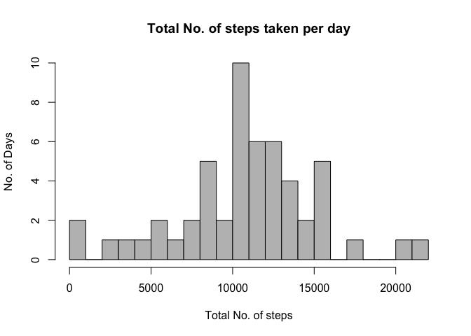
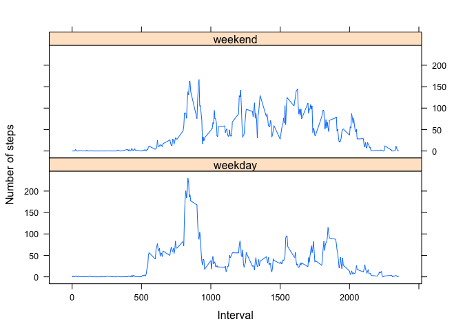

# Reproducible Research: Peer Assessment 1
***

### Loading and preprocessing the data


- First we will prepare the data for processing by reading the data file named : "activity.csv"" into a vector named "origData".
- From there we will proceed to the removal of the NAs in the original data and assign a new vector "RefineData".


```r
origData = read.csv("activity.csv")
RefineData = na.omit(origData)
```

***

### What is mean total number of steps taken per day?
- Using ddply to count the steps according to each date.
- Initiating the library to load "plyr", package for ddply


```r
library(plyr)
```

###### Applying ddply:

```r
totalSteps.Day = ddply(RefineData, .(date), summarise, steps=sum(steps))
```

- From the "totalSteps.Day" dataframe, we will plot the histogram.

```r
hist(totalSteps.Day$steps, breaks = 30, main="Total No. of steps taken per day", 
     xlab="Total No. of steps", ylab = "No. of Days", col="grey")
```

 

***

###### The mean number of steps taken per day:

```r
mean(totalSteps.Day$steps)
```

```
## [1] 10766
```

```r
median(totalSteps.Day$steps)
```

```
## [1] 10765
```

***

### What is the average daily activity pattern?

- Using ddply to allocate the intervals to the ave steps taken

```r
avePerInt = ddply(RefineData , .(interval), summarise, steps=mean(steps))
```
- Using ggplot to plot out the graph, from the dataframe "avePerInt"
- Loading "ggplot2"" package into the library, for ggplot cmd
- The following graph shows the average daily activity pattern over 5mins intervals.


```r
library(ggplot2)
ggplot(data=avePerInt, aes(x=interval, y=steps)) +
    geom_line(color = "red", size = 1.0) +
    labs(title = "Time Series Plot of the 5-minute Intervals",
             x = "5-minute interval",
             y = "average number of steps taken")
```

 

***

- max number of steps within the dataframe "avePerInt" accquired using the which.max subset

```r
avePerInt[which.max(avePerInt$steps),]
```

```
##     interval steps
## 104      835 206.2
```

***

### Imputing missing values
- Using the Sum function on the original Data to verify number of NAs available.

```r
sum(is.na(origData))
```

```
## [1] 2304
```

- The missing data with mean values of that 5min interval will be filled with the mean of that 5min interval. Which will be added into a newly created dataset, "NuData"

```r
NuData = origData
    for (i in 1:nrow(NuData)) {
            if (is.na(NuData$steps[i])) {
            NuData$steps[i] <- avePerInt$steps[which(NuData$interval[i] 
            == avePerInt$interval)]
        }
    }
```

- A histogram of the "NuData" dataset with total number of steps (using ddply) taken each day is plotted. 
- A report of the mean and median total number of steps taken per day is recorded and compared with the dataset of the "RefineData"

```r
NtotalSteps.Day = ddply(NuData, .(date), summarise, steps=sum(steps))
hist(NtotalSteps.Day$steps, breaks = 30, main="Total No. of steps taken per day"
     , xlab="Total No. of steps", ylab = "No. of Days", col="green")
```

 

##### Mean and median of the total number of steps taken per day of "NuData" dataset

```r
mean(NtotalSteps.Day$steps)
```

```
## [1] 10766
```

```r
median(NtotalSteps.Day$steps)
```

```
## [1] 10766
```

***

- Comparing data from "RefineData" (Original) to "NuData" (N.As filled up by means)

```r
mean(NtotalSteps.Day$steps) - mean(totalSteps.Day$steps)
```

```
## [1] 0
```

```r
median(NtotalSteps.Day$steps) - median(totalSteps.Day$steps)
```

```
## [1] 1.189
```

###### After imputing the mean to fill up the N.As, both means are the same. However the second median has 1.188679 more than the first.

***

## Are there differences in activity patterns between weekdays and weekends?
- Using Sys.setlocale to set the days of the week from monday to sunday, and create a weekday col for the NuData, for allocation of the day of the week data.

```r
Sys.setlocale("LC_TIME")
```

```
## [1] "en_US.UTF-8"
```

```r
NuData$weekdays <- weekdays(as.Date(NuData$date))
```

- Assigning Monday - Fridays into weekdays and Saturdays - Sundays into weekends using ifelse statement.

```r
NuData$weekdays <- ifelse(NuData$weekdays %in% c("Saturday", "Sunday"),
                    "weekend", "weekday")
```

- We will answer this question by plotting a panel graph. First, we will use ddply to sort out the data for plotting.
- Plotting the answer, (loading the lattice package into the library for use of xyplot cmd)

```r
aveWeekDE <- ddply(NuData, .(interval, weekdays), summarise, steps=mean(steps))

library(lattice)
xyplot(steps ~ interval | weekdays, data = aveWeekDE, 
       layout = c(1, 2), type="l",
       xlab = "Interval", ylab = "Number of steps")
```

 

***

###### Thus with the graph, we can see that there is a slight different in activity usages between weekends and weekdays. The weekday has the highest peak to the number of steps used. While the weekend has the higher frequency of use around 150 steps.

***
